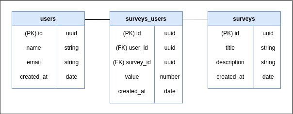

<h1 align="center">NPS-API</h1>

<p align="center">
  <a href="#about-the-project">About The Project</a>&nbsp;&nbsp;&nbsp;|&nbsp;&nbsp;&nbsp;
  <a href="#usage">Usage</a>&nbsp;&nbsp;&nbsp;|&nbsp;&nbsp;&nbsp;
  <a href="#installation">Installation</a>&nbsp;&nbsp;&nbsp;|&nbsp;&nbsp;&nbsp;
  <a href="#contributing">Contributing</a>
</p>

<h2></h2>
<!-- 
<p align="center">
      <a href="#">
        
      </a>
</p> -->

<!-- PROJECT LOGO -->
<!-- <br />
<p align="center">
  <a href="https://github.com/othneildrew/Best-README-Template">
    
  </a>

  <h3 align="center">Best-README-Template</h3>

  <p align="center">
    An awesome README template to jumpstart your projects!
    <br />
    <a href="https://github.com/othneildrew/Best-README-Template"><strong> View Demo »</strong></a>
    <br />
  </p>
</p> -->

<!-- TABLE OF CONTENTS -->
<!-- <details open="open">
  <summary>Table of Contents</summary>
  <br>
  <ol>
    <li>
      <a href="#about-the-project">About The Project</a>
    </li>
    <li><a href="#usage">Usage</a></li>
    <li><a href="#installation">Installation</a></li>
    <li><a href="#contributing">Contributing</a></li>
    <li><a href="#license">License</a></li>
  </ol>
</details> -->

<!-- ABOUT THE PROJECT -->
## About The Project


> Restful API in node.js to calculate NPS

Restful API developed in NodeJS during the 4th Next Level Week of [Rocketseat](https://rocketseat.com.br/).<br>It is possible to register users and surveys, send email to users to answer the satisfaction survey and through the survey the NPS (Satisfaction Metric) is calculated.

<!-- API Restful desenvolvida em NodeJS durante a 4º Next Level Week da [Rocketseat](https://rocketseat.com.br/).<br> Nela é possível cadastrar usuários e pesquisas, contem uma função de envio de e-mail para os usuários responderem a pesquisa de satisfação e através da pesquisa é realizado o cálculo do NPS (Métrica de satisfação). -->

<!-- <br> -->

### Built With

* Yarn
* Node.js
* Express
* Typescript
* TypeORM
* Jest
* Nodemailer
* Ethereal
* Handlebars

Back-end as Node.js, Yarn as package manager, Typescript as the project language, Express for route management, TypeORM for data manipulation, Jest for automated tests and Nodemailer in conjunction with Ethereal (SMTP protocol) and Handlebars for sending email.

<!-- Back-end com Node.js, Yarn como gerenciador de pacotes, Typescript como a linguagem do projeto, Express para gerenciamento das rotas, TypeORM para manipulação dos dados, Jest para testes automatizados e Nodemailer em conjunto com o Ethereal (protocolo SMTP) e Handlebars para o envio de e-mail. -->

<!-- USAGE -->
## Usage

### Database diagram



<!-- ### Json
#### **users**
post url/users
```json
{
  "name": "teste2",
  "email": "teste2@teste.com"
}
```
#### **surveys**
post url/surveys
```json
{
  "title": "queremos ouvir sua opnião",
  "description": "de 0 a 10, quanto vc recomendaria a rocketseat"
}
```
#### **sendmail**
post/SendMail
```json
{
	"email": "teste2@teste.com",
	"survey_id": "18bc72e6-7192-4a2f-9771-88455aa9b0b5"
}
``` -->

<!-- INSTALATION -->
## Installation
If you use debian-based linux you can execute ```install.sh``` localizate in /public/.

#### 1. Clone git repository
```bash
git clone "https://github.com/almeida-matheus/node-api.git"
```

#### 2. Install requirements
Install ```node```, ```npm``` and ```yarn``` . </br>
Debian-based linux as root:
```bash
## node and npm
curl -sL https://deb.nodesource.com/setup_lts.x | bash -
apt-get install -y nodejs

## yarn
curl -sS https://dl.yarnpkg.com/debian/pubkey.gpg | sudo apt-key add -
echo "deb https://dl.yarnpkg.com/debian/ stable main" | sudo tee /etc/apt/sources.list.d/yarn.list

sudo apt update && sudo apt install --no-install-recommends yarn

echo 'export PATH="$PATH:`yarn global bin`"' >> ~/.bashrc
##obs: if you are using zsh shell change ~/.bashrc to ~/.zshrc
```

#### 3. Install the dependencies
```bash
yarn add express
yarn add @types/express -D
yarn add typescript -D
yarn add ts-node-dev -D
yarn add uuid
yarn add @types/uuid -D
yarn add jest @types/jest -D
yarn add ts-jest -D
yarn add supertest @types/supertest -D
yarn add nodemailer
yarn add @types/nodemailer -D
yarn add handlebars
## database
npm install typeorm --save
npm install reflect-metadata --save
npm install @types/node --save-dev
## driver database sqlite
npm install sqlite3 --save
```

#### 4. Run the server
```bash
yarn dev

```
The project will be available at [http://localhost:3333](http://localhost:3333) in the browser.

<!-- CONTRIBUTING -->
## Contributing

Contributions are what make the open source community such an amazing place to be learn, inspire, and create. Any contributions you make are **greatly appreciated**.

1. Fork the Project
2. Clone this project (`git clone https://github.com/almeida-matheus/api-node.git`)
3. Create your Feature Branch (`git checkout -b featureBranch`)
4. Commit your Changes (`git commit -m 'Add some AmazingFeature'`)
5. Push to the Branch (`git push origin featureBranch`)
6. Open a Pull Request

<!-- LICENSE -->
<!-- ## License

Distributed under the MIT License. See [LICENSE](LICENSE) for more information. -->

